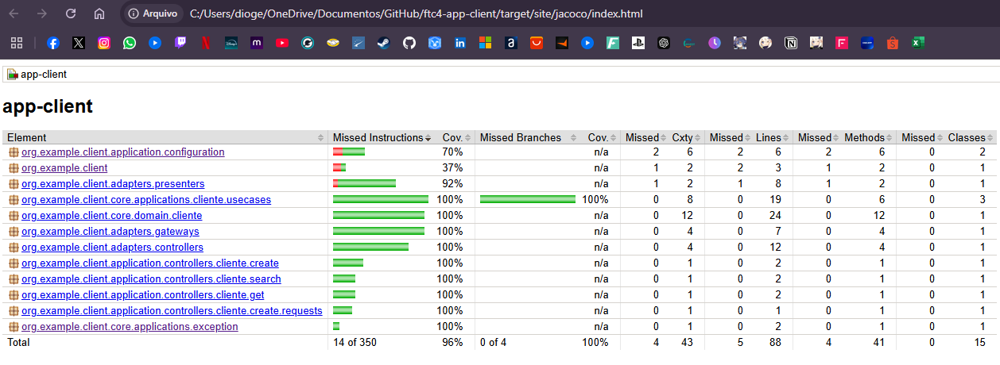

## Serviço de cliente

Service que gerencia clientes em uma plataforma de e-commerce. Ele oferece funcionalidades para criar, atualizar e listar clientes.

# Testes
* Para rodar os testes, execute o comando `mvn test` na raiz do projeto.

Cobertura de testes:
